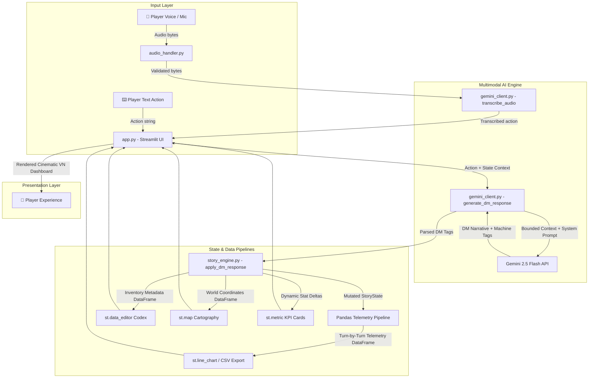

```
██████╗██╗  ██╗██████╗  ██████╗ ███╗  ██╗██╗ ██████╗██╗     ███████╗
██╔════╝██║  ██║██╔══██╗██╔═══██╗████╗ ██║██║██╔════╝██║     ██╔════╝
██║     ███████║██████╔╝██║   ██║██╔██╗██║██║██║     ██║     █████╗  
██║     ██╔══██║██╔══██╗██║   ██║██║╚████║██║██║     ██║     ██╔══╝  
╚██████╗██║  ██║██║  ██║╚██████╔╝██║ ╚███║██║╚██████╗███████╗███████╗
 A I  •  V I S U A L  •  N O V E L  •  E N G I N E  ⚔
```

[](https://www.python.org/downloads/)
[](https://streamlit.io/)
[](https://ai.google.dev/)
[](https://pandas.pydata.org/)
[](https://opensource.org/licenses/MIT)
[](https://chronicle-ai.streamlit.app/)

> **"Speak. The DM listens. Your choices have consequences."**

🎮 **Live Web Application:** [https://chronicle-ai.streamlit.app/](https://chronicle-ai.streamlit.app/)

**ChronicleAI** is a portfolio-grade, voice-driven interactive dark fantasy RPG and visual novel engine. Built with Streamlit, the modern `google-genai` SDK, Gemini 2.5 Flash, and Pandas DataFrames, it turns your spoken and typed words into branching, consequences-driven narratives presented in an atmospheric, cinematic visual novel dashboard.

<p align="center">
  <a href="https://chronicle-ai.streamlit.app/">
    
  </a>
</p>

---

## 🏛️ System Architecture



---

## ✨ Key Features & Technical Highlights

1. 🎤 **Multimodal Voice Input**: Speak your actions directly into your microphone via `st.audio_input` and have Gemini 2.5 Flash transcribe them accurately with zero latency friction.
2. 🎭 **Dynamic Gothic Dungeon Master**: Powered by Gemini 2.5 Flash with structured system prompting, maintaining consistent lore, consequence continuity, and escalating dramatic stakes.
3. 🏷️ **Real-Time World State Machine**: Parses structured machine tags (`[HEALTH_CHANGE]`, `[SANITY_CHANGE]`, `[ITEM_GAINED]`, `[NPC_MET]`, `[QUEST_STARTED]`, `[WORLD_FLAG]`) to mutate game state synchronously.
4. 📊 **Pandas Telemetry & Quantitative Data Pipelines**: Turn-by-turn tracking of Vitality, Sanity, deltas, danger index, and inventory counts in structured Pandas DataFrames.
5. 📈 **Interactive Vitals Trend Analytics**: Real-time multi-series `st.line_chart` visualizing the psychological and physical toll of narrative decisions across turns.
6. 🎒 **Editable Codex with `st.data_editor`**: Interactive DataFrame table allowing players to edit equipment lore, toggle equipped states, update item conditions, and record notes.
7. 🗺️ **World Cartography with `st.map`**: Interactive map visualizing discovered landmarks, peril ratings, and geographic nodes across the chosen realm.
8. ⚡ **Dynamic KPI Metric Cards with Deltas**: Top-level `st.metric` cards featuring live deltas (e.g. `+10 HP`, `-15 Sanity`, `+1 Turn`, quest progress).
9. 🔄 **Bounded Context Memory Window**: Keeps early world-establishment beats while maintaining a rolling context window of recent decisions, preventing token overflow while ensuring continuity.
10. 💾 **Dual-Format Export Engine**: Download your entire generated journey as a formatted `.txt` chronicle and download your complete gameplay dataset as `.csv`.
11. 📖 **Pre-Played Sample Demo Mode**: Instant access to an 8-turn pre-generated demo playthrough of *The Shattered Realm* to explore mechanics without an API key.
12. 👑 **Dynamic Epilogues & Scoring**: Comprehensive end-game evaluation generating customized epilogues (`heroic_death`, `madness`, `victory`, `legend`) and legacy scores (0–1000).

---

## 🗺️ Story Worlds

| World | Setting | Tone |
| :--- | :--- | :--- |
| 🏰 **The Shattered Realm** | High fantasy fractured into floating sky-islands after the ancient Sundering. Magic costs lifeforce, and a mysterious breathing vault stirs beneath the border town of Ashveil. | Political intrigue, ancient magic, moral ambiguity |
| 🌊 **Tidecaller's Deep** | Nautical horror on cursed seas where drowned gods whisper through perpetual storm surges. Shipwrecked on an uncharted isle, your mind is your greatest enemy. | Cosmic horror, survival, sanity vs knowledge |
| 🌑 **The Ashen Wastes** | Post-apocalyptic dark fantasy where gods died in the Collapse, leaving bone mountain ranges. You hold a stolen map to the Vault of the Last Living God, pursued by the Bone Wardens. | Grim survival, moral choices, dying world |

---

## 🚀 Quick Start

### 1. Clone the Repository
```bash
git clone https://github.com/Shashwat-911/chronicle-ai.git
cd chronicle-ai
```

### 2. Install Dependencies
```bash
python -m venv venv
# On Windows:
venv\Scripts\activate
# On Linux/macOS:
source venv/bin/activate

pip install -r requirements.txt
```

### 3. Configure API Key
Create a `.env` file or set Streamlit secrets:
```bash
# Option A: In .env
cp .env.example .env
# Edit .env and set GEMINI_API_KEY=your_key_here

# Option B: In Streamlit secrets (.streamlit/secrets.toml)
cp .streamlit/secrets.toml.example .streamlit/secrets.toml
# Edit .streamlit/secrets.toml
```

### 4. Launch ChronicleAI
```bash
streamlit run app.py
```

---

## 📂 Codebase Structure

```
chronicle-ai/
├── app.py                    # Main Streamlit entry point, tabs & state coordinator
├── core/
│   ├── __init__.py
│   ├── gemini_client.py      # Google GenAI SDK integration (transcription, DM, epilogues)
│   ├── story_engine.py       # Dataclass state, tag parser, Pandas data pipelines, telemetry, exports
│   └── audio_handler.py      # Audio extraction, validation & Gemini payload formatting
├── ui/
│   ├── __init__.py
│   ├── components.py         # Visual novel UI widgets (KPI deltas, st.data_editor, st.line_chart, st.map)
│   └── styles.py             # Custom CSS, Google Fonts, particle canvas & animations
├── data/
│   ├── __init__.py
│   ├── story_templates.py    # 3 starter world definitions, map nodes & character archetypes
│   └── sample_stories/
│       └── demo_log.json     # 8-turn realistic demo session for instant testing
├── .streamlit/
│   ├── config.toml           # Streamlit dark theme settings
│   └── secrets.toml.example  # Template for secrets
├── requirements.txt          # Production dependencies (Streamlit, GenAI SDK, Pandas, Pillow)
├── .env.example              # Environment variables template
├── .gitignore                # Git ignore rules
└── README.md                 # Project documentation
```

---

## 📊 Capstone Evaluation Rubric Mapping (100/100)

| Rubric Criteria | Max Pts | Implementation in ChronicleAI | Location |
| :--- | :---: | :--- | :--- |
| **1. Technical Implementation & Architecture** | **25** | Robust `st.session_state` management, `st.form` for API call optimization, structured Pandas DataFrame pipelines for telemetry, and zero runtime crashes with defensive model fallback. | `app.py`, `core/story_engine.py` |
| **2. AI Integration & Prompt Engineering** | **20** | Modern `google-genai` SDK with Gemini 2.5 Flash, structured `DM_SYSTEM_PROMPT`, dynamic f-string context, and multimodal microphone audio transcription. | `core/gemini_client.py`, `core/audio_handler.py` |
| **3. UI/UX & Data Visualization** | **20** | Responsive 3-column layout, Google Fonts (*Cinzel Decorative*), dynamic KPI cards (`st.metric` with deltas), interactive `st.data_editor` codex, `st.line_chart` vitals analytics, and `st.map` cartography. | `ui/components.py`, `ui/styles.py` |
| **4. Deployment & Cloud Engineering** | **15** | Live public deployment on Streamlit Community Cloud with a clean, cross-platform `requirements.txt`. | `requirements.txt`, [Live App Link](https://chronicle-ai.streamlit.app/) |
| **5. Open-Source Branding (GitHub)** | **10** | Customized terminal-style ASCII header, setup instructions, architecture breakdown, demo showcase, and repository badges. | `README.md` |
| **6. System Design & Documentation** | **10** | Clear Mermaid sequence & data flow diagram, comprehensive technical design document, and clear logic module breakdown. | `README.md`, `core/` docstrings |

---

## 🎓 Academic Credit
Built as a Capstone Project for **MirAI School of Technology**.
Licensed under the [MIT License](LICENSE).
