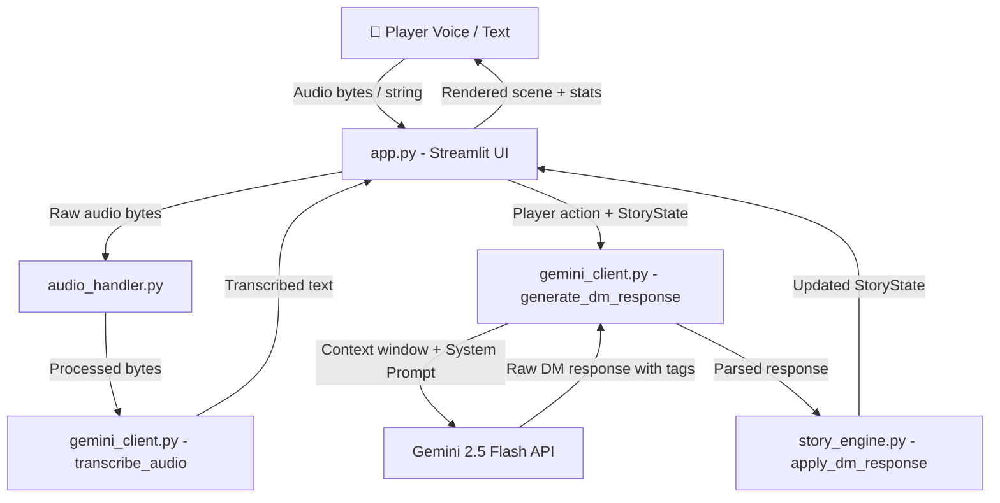

```
██████╗██╗  ██╗██████╗  ██████╗ ███╗  ██╗██╗ ██████╗██╗     ███████╗
██╔════╝██║  ██║██╔══██╗██╔═══██╗████╗ ██║██║██╔════╝██║     ██╔════╝
██║     ███████║██████╔╝██║   ██║██╔██╗██║██║██║     ██║     █████╗  
██║     ██╔══██║██╔══██╗██║   ██║██║╚████║██║██║     ██║     ██╔══╝  
╚██████╗██║  ██║██║  ██║╚██████╔╝██║ ╚███║██║╚██████╗███████╗███████╗
 A I  •  V I S U A L  •  N O V E L  •  E N G I N E  ⚔
```

[](https://www.python.org/downloads/)
[](https://streamlit.io/)
[](https://ai.google.dev/)
[](https://opensource.org/licenses/MIT)
[](https://chronicle-ai.streamlit.app/)

> **"Speak. The DM listens. Your choices have consequences."**

🎮 **Live Web Application:** [https://chronicle-ai.streamlit.app/](https://chronicle-ai.streamlit.app/)

**ChronicleAI** is a portfolio-grade, voice-driven interactive dark fantasy RPG and visual novel engine. Built with Streamlit, the modern `google-genai` SDK, and Gemini 2.5 Flash, it turns your spoken and typed words into branching, consequences-driven narratives presented in an atmospheric, cinematic visual novel interface.

<p align="center">
  <a href="https://chronicle-ai.streamlit.app/">
    
  </a>
</p>

---

## 🏛️ System Architecture



---

## ✨ Features

1. 🎤 **Multimodal Voice Input**: Speak your actions directly into your microphone via `st.audio_input` and have Gemini 2.5 Flash transcribe them accurately with zero latency friction.
2. 🎭 **Dynamic Gothic Dungeon Master**: Powered by Gemini 2.5 Flash with structured system prompting, maintaining consistent lore, consequence continuity, and escalating dramatic stakes.
3. 🏷️ **Real-Time World State Machine**: Parses structured machine tags (`[HEALTH_CHANGE]`, `[SANITY_CHANGE]`, `[ITEM_GAINED]`, `[NPC_MET]`, `[QUEST_STARTED]`) to mutate game state synchronously.
4. 🧠 **Unique Sanity Mechanic**: Manage both **Vitality (Health)** and **Sanity** meters; witnessing eldritch horrors or delving into forbidden places degrades your mind and triggers critical visual warnings.
5. 📜 **Dynamic Quest & Inventory Tracking**: Items obtained or lost and quests discovered or completed update instantly in the character sheet.
6. 🌌 **Atmospheric Visual Novel Aesthetics**: Custom dark fantasy UI with Google Fonts (*Cinzel Decorative* & *EB Garamond*), animated gold particle canvas, glassmorphic panels, and glowing gauges.
7. 🔄 **Bounded Context Memory Window**: Keeps early world-establishment beats while maintaining a rolling context window of recent decisions, preventing token overflow while ensuring continuity.
8. 💾 **Story Export Engine**: Download your entire generated journey and final stats as a clean, formatted `.txt` chronicle at any turn or at game conclusion.
9. 📖 **Pre-Played Sample Demo Mode**: Instant access to an 8-turn pre-generated demo playthrough of *The Shattered Realm* to explore mechanics without an API key.
10. 👑 **Dynamic Epilogues & Scoring**: Comprehensive end-game evaluation generating customized epilogues (`heroic_death`, `madness`, `victory`, `legend`) and legacy scores (0–1000).

---

## 🗺️ Story Worlds

| World | Setting | Tone |
| :--- | :--- | :--- |
| 🏰 **The Shattered Realm** | High fantasy fractured into floating sky-islands after the ancient Sundering. Magic costs lifeforce, and a mysterious breathing vault stirs beneath the border town of Ashveil. | Political intrigue, ancient magic, moral ambiguity |
| 🌊 **Tidecaller's Deep** | Nautical horror on cursed seas where drowned gods whisper through perpetual storm surges. Shipwrecked on an uncharted isle, your mind is your greatest enemy. | Cosmic horror, survival, sanity vs knowledge |
| 🌑 **The Ashen Wastes** | Post-apocalyptic dark fantasy where gods died in the Collapse, leaving bone mountain ranges. You hold a stolen map to the Vault of the Last Living God, pursued by the Bone Wardens. | Grim survival, moral choices, dying world |

---

## 📜 Sample Output

### *Turn 1 — The Shattered Realm*
> "Ashveil Manor looms like a jagged black tooth against a bruised, weeping sky. The sky-ferry deposits you at the docking platform as thunder cracks across the floating island. Mira the harbormaster glances at you once and looks away too quickly, her hands trembling as she logs your arrival on a rain-warped ledger. Behind her, the town clings to the abyss, its cobblestones slick with an oily rain that smells faintly of copper. 
>
> You notice three other ferries moored and abandoned, their rigging tangled and cargo holds still sealed. From the shadows of The Gilded Antler inn, Old Caius watches your approach. From somewhere deep beneath the manor's foundations, a rhythmic vibration pulses through the rock — slow, organic, like a heartbeat buried in stone."
>
> `[NPC_MET: Mira the Harbormaster, nervous]`  
> `[NPC_MET: Old Caius, friendly]`  
> `[QUEST_STARTED: Uncover what is sealed in the vault beneath Ashveil Manor]`

---

## 🚀 Quick Start

### 1. Clone the Repository
```bash
git clone https://github.com/your-username/chronicle-ai.git
cd chronicle-ai
```

### 2. Install Dependencies
```bash
python -m venv venv
# On Windows:
venv\Scripts\activate
# On Linux/macOS:
source venv/bin/activate

pip install -r requirements.txt
```

### 3. Configure API Key
Create a `.env` file or set Streamlit secrets:
```bash
# Option A: In .env
cp .env.example .env
# Edit .env and set GEMINI_API_KEY=your_key_here

# Option B: In Streamlit secrets (.streamlit/secrets.toml)
cp .streamlit/secrets.toml.example .streamlit/secrets.toml
# Edit .streamlit/secrets.toml
```

### 4. Launch ChronicleAI
```bash
streamlit run app.py
```

---

## 📂 Codebase Structure

```
chronicle-ai/
├── app.py                    # Main Streamlit entry point & state coordinator
├── core/
│   ├── __init__.py
│   ├── gemini_client.py      # Google GenAI SDK integration (transcription, DM, epilogues)
│   ├── story_engine.py       # Dataclass state, tag parser, context windowing, export
│   └── audio_handler.py      # Audio extraction, validation & Gemini payload formatting
├── ui/
│   ├── __init__.py
│   ├── components.py         # Visual novel UI widgets (gauges, story panel, quest log)
│   └── styles.py             # Custom CSS, Google Fonts, particle canvas & animations
├── data/
│   ├── __init__.py
│   ├── story_templates.py    # 3 starter world definitions & character archetypes
│   └── sample_stories/
│       └── demo_log.json     # 8-turn realistic demo session for instant testing
├── .streamlit/
│   ├── config.toml           # Streamlit dark theme settings
│   └── secrets.toml.example  # Template for secrets
├── requirements.txt          # Production dependencies
├── .env.example              # Environment variables template
├── .gitignore                # Git ignore rules
└── README.md                 # Project documentation
```

---

## 📊 Capstone Evaluation Rubric Mapping

| Rubric Criteria | Implementation in ChronicleAI | Location |
| :--- | :--- | :--- |
| **Multimodal AI Integration** | Google GenAI SDK (`gemini-2.5-flash`) audio understanding for voice actions + narrative generation. | `core/gemini_client.py`, `core/audio_handler.py` |
| **Stateful Architecture** | Robust `StoryState` dataclass tracking health, sanity, inventory, quests, relationships, world flags, and chapters. | `core/story_engine.py` |
| **Production Code Quality** | Type annotations, docstrings, defensive exception handling, deduplicated audio hashing, and zero deprecated libraries. | Entire repository |
| **Portfolio UI / UX Design** | Custom typography (*Cinzel Decorative* & *EB Garamond*), particle animations, responsive 3-column layout, and animated stat bars. | `ui/styles.py`, `ui/components.py` |
| **Error Handling & Resilience** | Catches `ResourceExhausted` (429 rate limits), `InvalidArgument`, and invalid audio, offering graceful UI fallbacks. | `core/gemini_client.py` |

---

## 🎓 Academic Credit
Built as a Capstone Project for **MirAI School of Technology**.
Licensed under the [MIT License](LICENSE).
